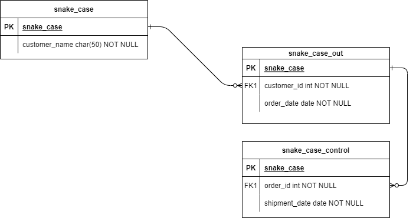

# Six by six Go
Anthony Morford

This project will be a six-by-six grid representing a section of a Go board.
## ER Diagram

|   | 1 | 2 | 3 | 4 | 5 | 6 |
|---|---|---|---|---|---|---|
| A | ⚫ |   | ⚪ |   |   | ⚫ |
| B |   | ⚪ |   | ⚫ |   |   |
| C |   |   | ⚫ |   | ⚪ |   |
| D | ⚪ |   |   | ⚫ |   |   |
| E |   | ⚫ |   |   | ⚪ |   |
| F | ⚫ |   | ⚪ |   |   | ⚪ |

## Render site
this is [the Render site] (https://six-by-six-go.onrender.com/)
